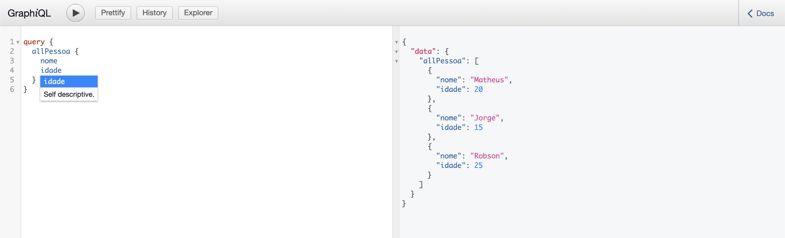

# QraphQL com Python

Repositório criado com intuito de estudos sobre o GraphQL e integrando utilizando o Python.

## Instalação

Python3 is required. \
PIP3 is required.

```shell
$ sudo apt install python3
$ sudo apt install python3-pip
```

Necessário instalar as bibliotecas com o arquivo  **requirements.txt**:


```shell
$ pip install -r requirements.txt
```

Neste lab, é utilizado a lib Strawberry para utilizarmos o GraphQL. \
Para rodarmos o servidor do Strawberry, basta inserir o seguinte comando no console:

```shell
$ strawberry server nome_do_arquivo
```
Exemplo: \


